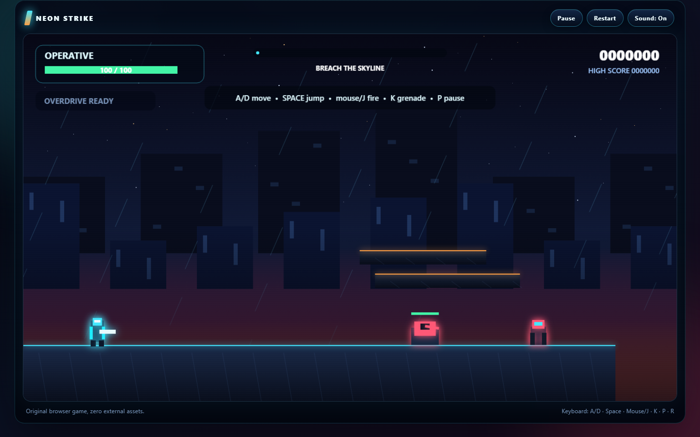

# Neon Strike: Skyline Breach



An original, zero-dependency HTML5 run-and-gun platformer inspired by the classic side-scrolling action genre. No Contra artwork, audio, level data, names, or source code is included.

## Play

Open `index.html` through a local web server, or publish the repository with GitHub Pages.

```powershell
npm run serve
```

Then open `http://127.0.0.1:4173`.

## Controls

| Action | Keyboard | Mouse / touch |
| --- | --- | --- |
| Move | `A` / `D` or arrow keys | Left / right buttons |
| Jump / double jump | `Space` or `W` | Jump button |
| Fire | `J` / `Z` | Left click or Fire button |
| Grenade | `K` / `X` | Grenade button |
| Pause | `P` / `Esc` | Pause button |
| Restart | `R` | Restart button |
| Mute | `M` | Sound button |

## Features

- Original neon city setting and procedurally placed level layouts.
- 360-degree pointer aiming, keyboard aiming, double jump, grenades, and overdrive weapon pickups.
- Troopers, drones, turrets, and a three-phase boss.
- Parallax skyline, particles, screen shake, generated sound effects, and a procedural music loop.
- Responsive desktop and mobile controls.
- Local high score persistence.
- Pure logic modules and automated Node tests.

## Verification

```powershell
npm run verify
```

This performs syntax checks for every browser module and runs the unit test suite covering collision resolution, deterministic level generation, aiming, projectile bursts, boss phases, and scoring.

With the local server running, an optional headless browser smoke test verifies real input and weapon firing:

```powershell
npm run smoke
```

## Project structure

```text
index.html              Browser entry point
styles.css              Responsive presentation
src/core.js             Deterministic game logic and pure helpers
src/audio.js            Web Audio sound and music generation
src/game.js             Canvas renderer, game loop, input, and entities
tests/core.test.js      Unit tests
tools/serve.mjs         Local static server
tools/browser-smoke.mjs Headless browser interaction test
.github/workflows/ci.yml Verification workflow
```

## Research references

The implementation is original. Public projects were reviewed only for architectural and genre inspiration:

- LittleJS - MIT license
- OpenGame - Apache-2.0 license
- SpaceHuggers - GPL-3.0 license, reviewed for high-level gameplay ideas only

No third-party source code or assets were copied.

## License

MIT. See `LICENSE`.